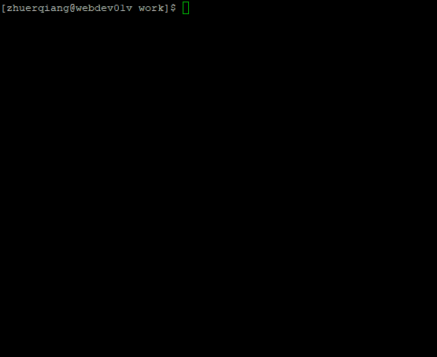

# mysql to go struct

该项目是一个根据数据库表结构生成 go struct 结构体文件的工具。 目前支持近支持 mysql，达梦数据库的模型生成，后续支持CRUD方法实现。
生成的 go 数据库结构体定义配合 ORM 库，比如GORM，XORM，ZORM，实现对数据的CRUD操作

## 使用方法

- 下载源代码
- 如果本地没有 goimports, 则请下载 ```go get -u golang.org/x/tools/cmd/goimports```
- 执行 ```go build -o gen main.go``` 构建可执行文件
- ```gen -h``` 查看指令集
- 所有的指令集类似 git 指令格式



## 版本规划

- [x] 根据配置文件，支持主流的 ORM 库，默认 gorm
- [ ] 根据配置文件，支持主流的 orm 库，beego
- [x] go format 仅格式化生成的文件
- [x] 增加达梦数据库配置
- [ ] 支持达梦数据库，ongoing

## 联系

mailto: zeq_jone@163.com
